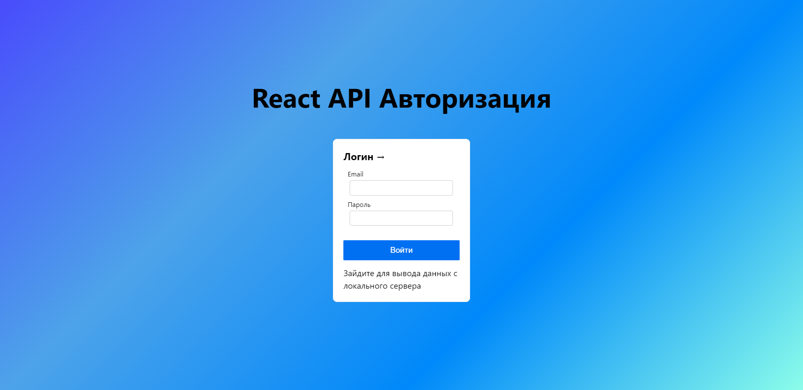
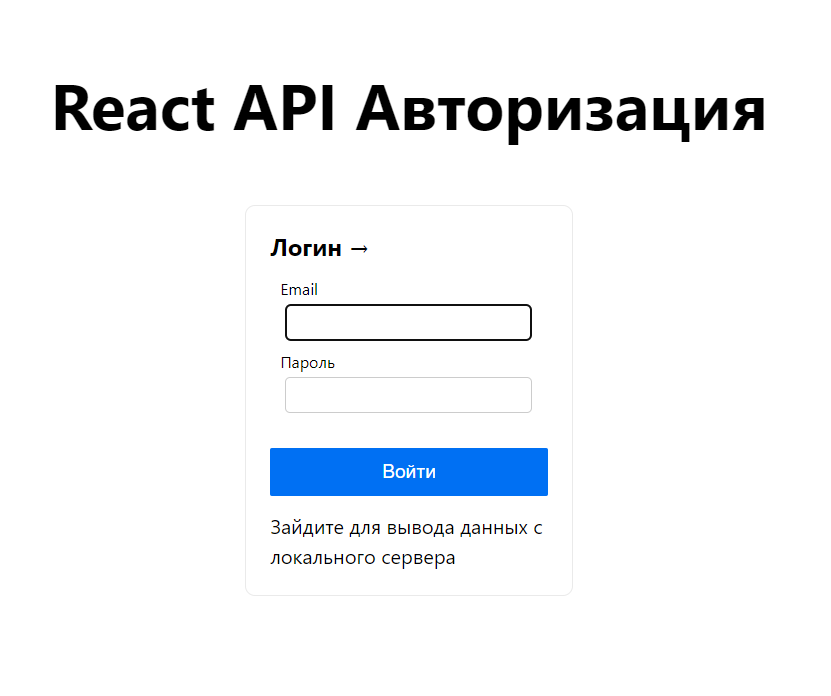
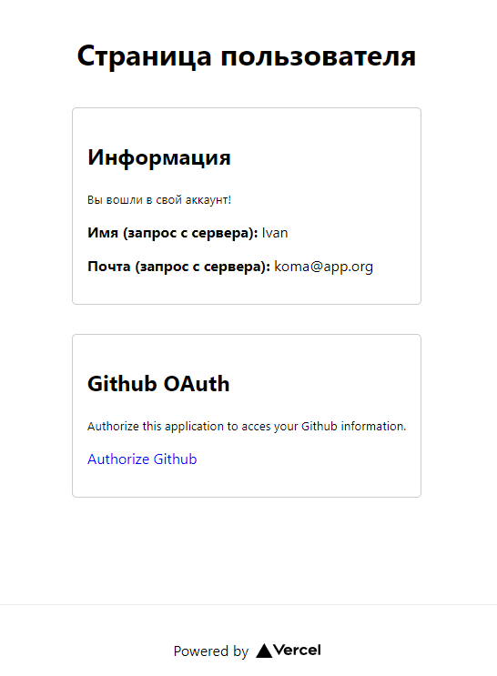

# NextJS Authorization logic with API
### Шаблон для авторизации при помощи NextJS и api, при поддержке Github Oauth (Возможно устарел из-за старого application! `В случае ошибки создайте новый`)

### Тестовый логин и пароль - email: `'koma@app.org'`, password: `'123'`,
        
#### Не забываем сменить api на localhost! Оставил в виде закомментированной строки для удобства

Gradient-Background test:

---

